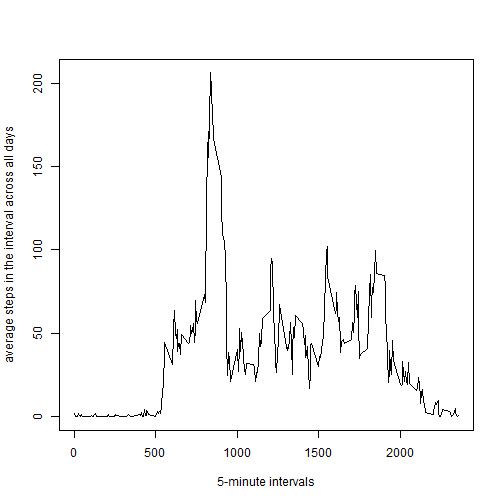

#Reproducible Research: Peer assessment 1
This document presents the results of peer assessments 1 of course Reproducible Research on coursera. This assignment makes use of data from a personal activity monitoring device. This device collects data at 5 minute intervals through out the day. The data consists of two months of data from an anonymous individual collected during the months of October and November, 2012 and include the number of steps taken in 5 minute intervals each day.

###Load data file

```r
cls = c("integer", "character", "integer")
df <- read.csv("activity.csv", head=TRUE, colClasses=cls, na.strings="NA")
head(df)
```

```
##   steps       date interval
## 1    NA 2012-10-01        0
## 2    NA 2012-10-01        5
## 3    NA 2012-10-01       10
## 4    NA 2012-10-01       15
## 5    NA 2012-10-01       20
## 6    NA 2012-10-01       25
```

###Rid off missing values

```r
df$date <- as.Date(df$date)
df_ign <- subset(df, !is.na(df$steps))
```

###Build a hystogram for daily total steps (ignoring missing data)

```r
dailysum <- tapply(df_ign$steps, df_ign$date, sum, na.rm=TRUE, simplify=T)
dailysum <- dailysum[!is.na(dailysum)]

hist(x=dailysum,
     col="red",
     breaks=20,
     xlab="Daily total steps",
     ylab="Frequency",
     main="The distribution of daily total (missing data ignored)")
```


 
###Calculate mean and median

```r
mean(dailysum)
```

```
## [1] 10766.19
```

```r
median(dailysum)
```

```
## [1] 10765
```

###Average daily activity pattern

```r
int_avg <- tapply(df_ign$steps, df_ign$interval, mean, na.rm=TRUE, simplify=T)
df_ia <- data.frame(interval=as.integer(names(int_avg)), avg=int_avg)

with(df_ia,
     plot(interval,
          avg,
          type="l",
          xlab="5-minute intervals",
          ylab="average steps in the interval across all days"))
```



###Find 5-minute interval containing maximum number of steps:

```r
max_steps <- max(df_ia$avg)
df_ia[df_ia$avg == max_steps, ]
```

```
##     interval      avg
## 835      835 206.1698
```

###Total number of missing values

```r
sum(is.na(df$steps))
```

```
## [1] 2304
```

###Fill in missing values using mean for affected 5-minute interval.

```r
df_impute <- df
ndx <- is.na(df_impute$steps)
int_avg <- tapply(df_ign$steps, df_ign$interval, mean, na.rm=TRUE, simplify=T)
df_impute$steps[ndx] <- int_avg[as.character(df_impute$interval[ndx])]
```

###Build a hystogram

```r
new_dailysum <- tapply(df_impute$steps, df_impute$date, sum, na.rm=TRUE, simplify=T)

hist(x=new_dailysum,
     col="red",
     breaks=20,
     xlab="daily steps",
     ylab="frequency",
     main="The distribution of daily total (with missing data imputed)")
```


###Calculate mean and median

```r
mean(new_dailysum)
```

```
## [1] 10766.19
```

```r
median(new_dailysum)
```

```
## [1] 10766.19
```

###Build a function to check if day a weekday or weekend

```r
is_weekday <- function(d) {
    wd <- weekdays(d)
    ifelse (wd == "Saturday" | wd == "Sunday", "weekend", "weekday")
}
```

###Apply the function

```r
wx <- sapply(df_impute$date, is_weekday)
df_impute$wk <- as.factor(wx)
head(df_impute)
```

```
##       steps       date interval      wk
## 1 1.7169811 2012-10-01        0 weekday
## 2 0.3396226 2012-10-01        5 weekday
## 3 0.1320755 2012-10-01       10 weekday
## 4 0.1509434 2012-10-01       15 weekday
## 5 0.0754717 2012-10-01       20 weekday
## 6 2.0943396 2012-10-01       25 weekday
```

###Build time series plot

```r
wk_df <- aggregate(steps ~ wk+interval, data=df_impute, FUN=mean)

library(lattice)
xyplot(steps ~ interval | factor(wk),
       layout = c(1, 2),
       xlab="Interval",
       ylab="Number of steps",
       type="l",
       lty=1,
       data=wk_df)
```


